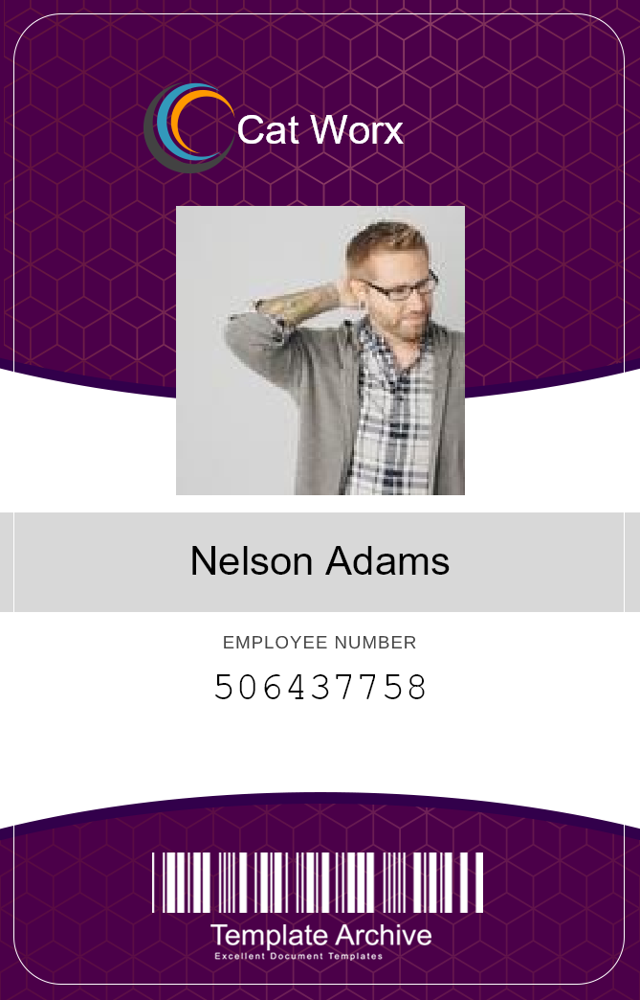

# cat-worx-badge-maker

Download the [Cat Worx Badge Maker](https://github.com/KDeLaria/cat-worx-badge-maker/archive/refs/heads/main.zip) app.

## Description

 The Cat Worx Badge Maker app is designed to create badges for the Cat Worx Company employees.

## Usage

When the program starts you will be asked if you would like to download randomized data from an API. If you wish to download randomized data type **Y** then hit **enter**.  Then badges will be created from the randomly generated employees.  If you do not want to download randomly generated data for employees you will be prompted to enter the first name of an employee.  Then you will be prompted to enter the last name of the employee.  Once you finish entering the name you will be prompted to enter a URL for the employee's photo.  Finally, you will be prompted to enter the employee's id number.  Then you will be prompted to enter the first name of another employee.  If you are done entering employee information hit **enter** when you are prompted to enter a first name to create the badges.

## License

This application is licensed under the MIT License.  See license document in this repository.